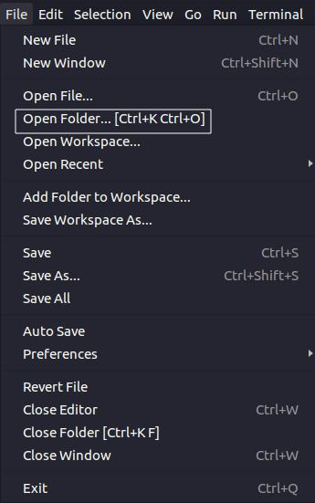

Tutorial de Instalação do VS Code e do Python 3.9.2
=========================================================

## Instalação do Interpretador (Python 3.9.2) 

Primeiramente, é necessário acessar o site oficial do [Python](https://www.python.org/) para realizar a instalação do interpretador.

Feito isso, pode-se selecionar *Download* e, em seguida, *Windows*, caso o usuário deseja instalar alguma versão anterior do Python. Nesse tutorial, será feita a instalação do Python 3.9.2, logo é possível realizar o *download* selecionando Python 3.9.2, como segue na Figura abaixo. Dessa forma, o *download* será feito.


Após o *download* do instalador, deve-se executar o programa. Antes de selecionar *Install Now*, verifique se *Add Python 3.9 to PATH* na parte inferior da janela está marcado, como visto a seguir.


Em seguida, é possível verificar a instalação sendo feita:


## Teste do Python e pip

Para verificar se o Python está funcionando corretamente, incluindo o pip, instalador de pacotes para o Python (do inglês, *package installer for Python*), é possível realizar alguns testes com o *Powershell*. Para testar, experimente instalar o pacote NumPy. Para isso, pressione  + R e digite *Powershell* e pressione OK, como visto na figura a seguir. 


Digite *pip install numpy* e pressione Enter no *Powershell*. Dessa forma, caso tenha dado tudo certo com a instalação, o pacote NumPy será instalado. Além disso, é possível digitar *python -V* e pressionar Enter para verificar a versão do Python instalada.

## Instalação da IDE (Visual Studio Code)

Diversos programadores profissionais utilizam o que é chamado de Ambiente de Desenvolvimento Integrado (do inglês, Integrated Development Environment - IDE), o qual aumenta significativamente a produtividade de quem a utiliza, uma vez que uma IDE possui diversas funcionalidades, atalhos, extensões capazes de facilitar o trabalho do profissional. Nesse tutorial, será utilizada a IDE Visual Studio Code (VS Code). Para realizar o *download* da IDE, é necessário acessar o site oficial do [VS Code](https://code.visualstudio.com/) e aperte o botão *Download for Windows*, como visto a seguir.


Após o *download* ser feito, é necessário executar o instalador. Após aceitar o acordo de licença,  pressione Próximo, como visto a seguir.


O instalador irá sugerir um local para realizar a instalação do *Software* como visto abaixo. 


Pode manter esse local ou então procurar por um local de sua preferência e apertar o botão Próximo novamente. A próxima página do instalador permite que o usuário escolha um nome para a pasta do Menu Iniciar onde será localizado os atalhos do programa, imagem seguinte. Pressione em Próximo. 


Na página seguinte, verifique se *Adicione em PATH* está marcado, como visto em seguida. Caso esteja, prossiga com a instalação. 


Após finalizar, o programa estará instalado em seu computador e poderá ser iniciado. A seguir, é possível ver duas imagens, uma antes da instalação, pedindo ao usuário que veja se os ítens foram preenchidos corretamente e outra durante a instalação.


## Configuração do Ambiente

Com o VS Code instalado, juntamente do interpretador do Python, basta abrir o VS Code, selecionar o símbolo  e pesquisar por Python. Selecione a opção vista na imagem a seguir e pressione o botão de instalar (*install* escrito em um retângulo verde).


Para verificar se está tudo funcionando corretamente, vá em *File* > *Open Folder* e selecione uma pasta para começar a programar. Você pode, por exemplo, criar uma pasta chamada de *Programas* dentro da pasta Documents e colocar para o VS Code abrir esta pasta, como visto a seguir:



Para criar um arquivo, basta selecionar o ícone de arquivo (Símbolo de uma folha com um + (mais)) na aba Explorer (Símbolo de uma folha na aba lateral do VS Code) e depois escolher um nome para o arquivo. Códigos em python possuem a extensão *py*, então experimente nomear o arquivo como *hello.py* por exemplo. Isso pode ser visto abaixo:


No arquivo recém-criado, adicione o seguinte código:

```python
def hello(name):
    print(f"Hello, {name}")

hello("Thiago")
```

Com o código escrito, basta pressionar no botão logo abaixo da engrenagem. Caso não tenha sido reconhecido ainda o interpretador, ficará escrito *No interpreter* em amarelo. Pressionando nele, basta selecionar a versão do Python desejada. Caso já tenha reconhecido uma versão do Python instalada, aparecerá a numeração dessa versão, o que poderá ser visto na imagem seguinte. Para rodar o arquivo, aperte no ícone indicando problemas encontrados no código (Ao lado do botão de seleção do interpretador) para abrir a aba do terminal como visto a seguir. Feito isso, selecione *Terminal* na aba que abriu e digite *python hello.py* onde *hello.py* é o nome do arquivo que se deseja compilar:


